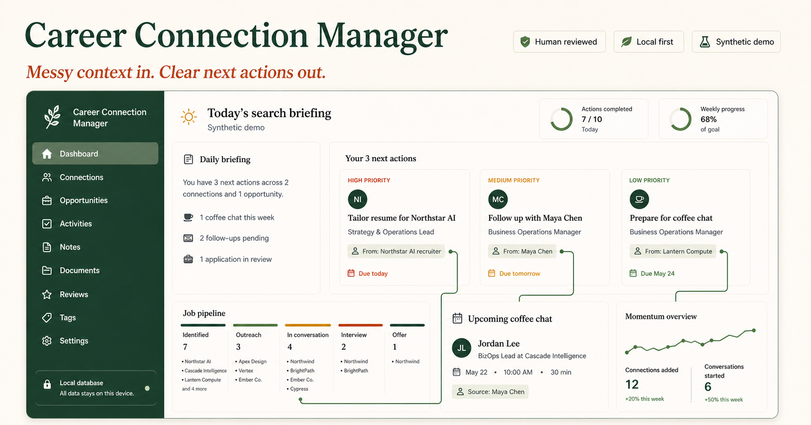

# Career Connection Manager

**A private CRM that turns messy job-search context into next actions.**

Career Connection Manager keeps the people, roles, conversations, and follow-ups behind a focused job search in one place.
Imports are reviewed before anything is saved, outreach stays in draft until you send it yourself, and the dashboard runs from local files you control.



> [!important] Product promise
> Paste messy career information and get a clear next action.

## Why this exists

Job seekers often keep goals, contacts, jobs, notes, and follow-ups in different places.
This project connects those pieces while keeping the user in control of every AI-assisted change.

The first target is Strategy and Business Operations work at frontier AI companies in the San Francisco Bay Area or Seattle.
See [[PRD]] for the complete product decisions, success measures, and roadmap.

## Product principles

- Local files are the source of truth.
- AI extraction is a suggestion until the user approves it.
- The system supports relationships instead of treating people like sales leads.
- No message or application is sent automatically.
- The public demo contains synthetic data only.

## Dashboard demo

The demo follows a fictional job seeker pursuing Strategy and Business Operations roles at three fictional AI companies: Northstar AI, Cascade Intelligence, and Lantern Compute.
It starts with the question the product is meant to answer each morning: **what should I do next, and why?**

Every item in the daily briefing leads back to its underlying record:

- **Tailor a resume** comes from a saved role, its fit evidence, and its due date.
- **Follow up with a contact** comes from a logged conversation and the next-action date.
- **Prepare for a coffee chat** comes from the person, job, and scheduled interaction already in the workspace.

The demo keeps the limits visible too.
Missing salary information stays missing, fit reasons can be inspected, uncertain imports wait for review, and a draft never counts as a sent message.
The names, companies, roles, and messages are synthetic.

The preview above is the README cover for the product.
The generated dashboard itself is available in [`demo_site/index.html`](demo_site/index.html).

Python 3.9 or newer is the only requirement.

```bash
./career demo
open demo_site/index.html
```

The demo creates fictional companies, people, jobs, interactions, and reminders.
It does not contain personal data.

For the clickable version, run the demo through the local server:

```bash
./career demo
./career serve --demo --data-dir demo_data --output demo_site/index.html
```

Then open [http://127.0.0.1:8765](http://127.0.0.1:8765).
The local server makes status and pursuit-decision controls work; rerun `./career demo` whenever you want to reset the fictional records.

## Start a private workspace

```bash
./career init
./career doctor
./career dashboard build
open site/index.html
```

Private files live in `private_data/`, which Git ignores.
Edit `private_data/target.md` to change the active career target.

## Core commands

### Add people and jobs

```bash
./career person add --name "Avery Kim" --title "BizOps Lead" --company "Example AI"
./career job add --title "Strategy & Operations Lead" --company "Example AI" --location "San Francisco, CA"
./career person list
./career job list
```

Add semicolon-separated connection points when saving a person.

```bash
./career person add --name "Avery Kim" --company "Example AI" \
  --connection-points "Both studied public policy; Interested in their market research"
```

In the **People** tab, click a person's name to expand their connection points, coffee-chat schedule, and exact sent-message history.
The **Coffee chat** column shows the nearest upcoming chat, or the most recent past chat when nothing upcoming is recorded.

### Paste messy text

Save copied text in a file, or pipe clipboard text into the import command.

```bash
./career import examples/paste.txt --type auto
pbpaste | ./career import --type auto
```

The command writes `pending_import.json` and prints every proposed field, uncertainty flag, and possible duplicate.
Edit that file if needed, then approve it.

```bash
./career review-import
./career review-import --approve
```

### Log actions and create reminders

Use IDs printed by the list commands or shown on the dashboard.

```bash
./career log outreach --person PERSON_ID --notes "Asked about the strategy team"
./career log coffee_chat --person PERSON_ID --date 2026-08-15 --notes "2:00 PM MT · Google Meet"
./career log application --job JOB_ID
./career task add --title "Prepare three questions" --due 2026-08-15 --person PERSON_ID
./career task done TASK_ID
```

Outreach automatically creates a follow-up reminder seven days later.
Logging a `coffee_chat` also creates a calendar-invite/confirmation task and a reminder for the day before.
The coffee-chat command requires an explicit date in exact `YYYY-MM-DD` form; put the time, timezone, and meeting link in `--notes`.
An application updates the job status and next action.

> [!warning] Rescheduled chats
> The current schema has no cancellation flag.
> Before logging a replacement date, clean up the earlier chat interaction and its tasks so both dates do not appear active or inflate the chat count.

### List or delete a coffee-chat record

List saved coffee chats, then copy the exact interaction ID you want to remove.

```bash
./career interaction list --type coffee_chat
./career interaction delete INTERACTION_ID --dry-run
./career interaction delete INTERACTION_ID --confirm
```

`--dry-run` is read-only and prints the interaction, the two generated tasks, any person-schedule change, and safety blockers.
`--confirm` rechecks the same plan under a writer lock, creates one operation backup, removes only exact matches, validates the data, and rebuilds `site/index.html`.
If the process is interrupted between CSV replacements, the operation journal makes the next mutating command restore the complete pre-delete backup; run `./career doctor` first if a list or preview reports an interrupted write.

If the record is the person's current and last upcoming chat, deletion stops rather than guessing the earlier relationship state.
Supply the state you want restored explicitly, for example:

```bash
./career interaction delete INTERACTION_ID --confirm \
  --restore-status replied \
  --restore-next-action "Follow up" \
  --restore-next-action-date 2026-08-16
```

### Review sent messages

The **Messages** dashboard tab shows the exact outreach and replies stored in `interactions.csv`.
Each message is linked to its person and job, and the search box can filter by contact, role, or message text.

In the **People** table, use the **Status** dropdown to move a contact from `To research` to `Reached out` (or another relationship stage). Choosing `Reached out` records today as the contact date and creates a seven-day follow-up task; refresh the browser with `Cmd+R` on macOS or `Ctrl+R` on Windows/Linux to reload the latest dashboard.

### Refresh, rebuild, and validate

For the clickable local dashboard, start the server in one Terminal window and leave it running.

```bash
cd /Users/jc5901/Documents/Dissertation/career/dashboard
./career serve
```

Open [http://127.0.0.1:8765](http://127.0.0.1:8765), then press `Cmd+R` on macOS or `Ctrl+R` on Windows/Linux whenever the data changes.
Each browser refresh rebuilds the dashboard from the current CSV files.

After the dashboard's Python code changes, stop the old server with `Ctrl+C`, run `./career serve` again, and then refresh the browser.

For a one-time static rebuild without the server, run:

```bash
cd /Users/jc5901/Documents/Dissertation/career/dashboard
./career doctor
./career dashboard build
open site/index.html
```

`doctor` reports the exact file, row, and field for invalid data.
The dashboard refuses to build until errors are fixed.

## Job status, fit, salary, and pursuit decisions

The Jobs view shows a separate salary column, an editable status, collapsed fit details, and a saved decision for every role.
Click the fit score to expand or hide its reasons.
Use the **Status** dropdown to move a role between `Saved`, `Researching`, `Ready To Apply`, `Applied`, `Interviewing`, and the remaining pipeline stages without reloading the page.
Choose **Undecided**, **Pursue**, **Maybe**, or **Pass** while the local dashboard server is running.

```bash
./career serve
```

Each choice is written to `private_data/jobs.csv` in `pursuit_decision` and `pursuit_decided_at`.
You can make the same change from the terminal.

```bash
./career job decision JOB_ID pursue
./career job decision JOB_ID maybe
./career job decision JOB_ID pass
```

## Human-reviewed agents

The project includes five optional agents powered by the OpenAI Responses API.
Set an API key in your shell before running them, and never place the key in a project file.

```bash
export OPENAI_API_KEY="your-key"
```

### Run agents from the dashboard

Start the local dashboard server instead of opening the HTML file directly.

```bash
./career serve
```

Open [http://127.0.0.1:8765](http://127.0.0.1:8765), choose **Agent Center**, and select an agent, person, job, or company.
Use **Preview prompt** without an API key, or use **Run agent** after setting the key.

The server listens only on `127.0.0.1`, so it is not exposed to other computers on the network.
Press `Ctrl+C` in the terminal to stop it.

### Draft a LinkedIn or email message

```bash
./career agent message --person PERSON_ID --job JOB_ID --channel linkedin
./career agent message --person PERSON_ID --channel email --goal "request a 20-minute coffee chat"
./career agent message --person PERSON_ID --stage connection_request
./career agent message --person PERSON_ID --channel email --stage chat_confirmation
./career agent message --person PERSON_ID --channel email --stage chat_reminder
```

The agent uses the saved outreach profile, outreach playbook, approved examples, relationship history, and an explicit message stage.
The first connection request and after-acceptance chat message are separate drafts: the first asks only to connect, while the second asks for a casual, specific conversation.
It never sends the message.

### Review a JD and tailor a resume

```bash
./career agent resume --job JOB_ID --resume resume.md
```

The agent shows matches, gaps, keywords, suggested edits, and a truthful tailored draft.
The MVP accepts `.md` or `.txt` resume sources and never overwrites the original.

### Research a person

```bash
./career agent person-research --person PERSON_ID
```

The agent searches public professional sources and returns an identity check, relevant work, conversation angles, unknowns, and source URLs.
It is instructed to avoid sensitive or unrelated personal information.

### Research a company and team

```bash
./career agent company-research --company COMPANY_ID --job JOB_ID
```

The agent researches products, strategy, recent changes, the relevant team, likely role challenges, and useful questions.
It must separate sourced facts from inference.

### Find a recruiter and prepare staged outreach

Save your real networking facts and interests in `private_data/outreach_profile.md`, then run:

```bash
./career agent recruiter-outreach --job JOB_ID
./career agent recruiter-outreach --job JOB_ID --person PERSON_ID
```

Without `--person`, the agent searches public professional sources for suitable recruiters and team contacts.
With `--person`, it researches that saved person first, checks for genuine overlap, and still flags a better contact when the evidence supports one.

It drafts a connection request, a post-acceptance request for a team conversation, a follow-up after that conversation, and a polite fallback.
It never infers protected traits from names or photos, and every personal fact must have a public source.

### Inspect before spending API credits

Add `--dry-run` to any agent command to print the full prompt without calling the API.
Completed drafts and reports are stored in `private_data/agent_outputs/` with a human-review warning.

The default model is `gpt-5.6-sol`, and `CAREER_AGENT_MODEL` can override it.
Research agents use the Responses API web-search tool; drafting agents do not access the web.

## Editable data

| File | Purpose |
|---|---|
| `target.md` | Career statement, role areas, seniority, locations, and keywords |
| `outreach_profile.md` | User-confirmed background, interests, and safe personalization rules |
| `companies.csv` | Target companies and careers pages |
| `people.csv` | Contacts, connection points, relationship status, and next action |
| `jobs.csv` | Job descriptions, pipeline status, fit, and next action |
| `interactions.csv` | Outreach, replies, chats, applications, and notes |
| `tasks.csv` | Due dates, priorities, and completion status |

Stable IDs connect records across files.
Automatic backups are stored beside the data before existing CSV files change.

## Architecture

```text
Pasted text / CSV / Markdown
             |
             v
       Import preview
             |
       human approval
             |
             v
   Validation + local records
        |             |
        v             v
 terminal actions   metrics
        |             |
        +------v------+
          static HTML
```

The import, storage rules, workflow rules, and renderer are separate functions.
This keeps future Greenhouse, Lever, calendar, or approved LinkedIn adapters replaceable.

## Responsible AI and privacy

The current extractor is deterministic and local, so it does not send text to an outside model.
It keeps the original source text, marks missing fields, checks duplicates, and requires approval before saving.

> [!warning] Private data
> Never copy `private_data/`, its backups, or a private dashboard into the public repository.

## Tests

```bash
python3 -m unittest discover -s tests -v
```

The tests cover initialization, validation, import approval, duplicate protection, reminders, and dashboard generation.

## Current scope

The MVP supports the complete manual workflow, a safe local paste-and-review flow, and five optional human-reviewed agents.
Public job-feed adapters, calendar integrations, automatic sending, and automatic resume editing are not included.

## Portfolio evidence to add after user testing

- A 60–90 second demo video.
- Three short usability-test notes.
- Time from paste to approved record.
- Import correction rate.
- Weekly task completion rate.
- One product decision changed by observed user behavior.
